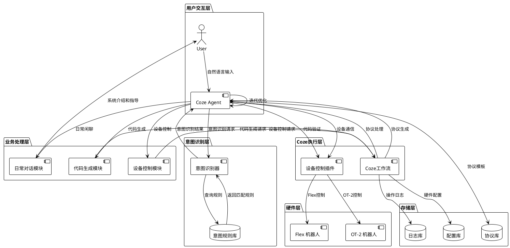
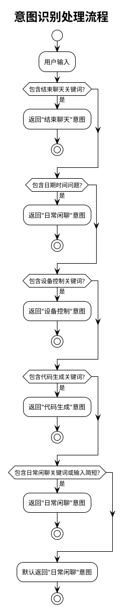
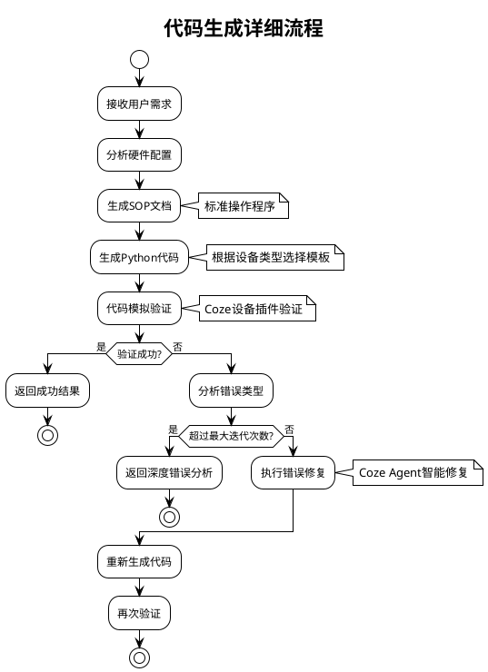
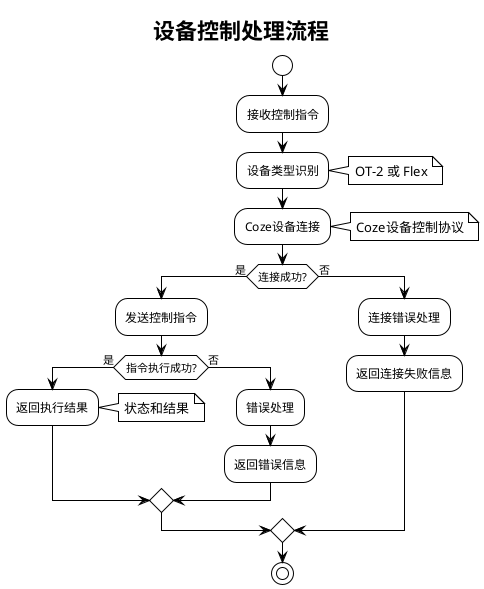
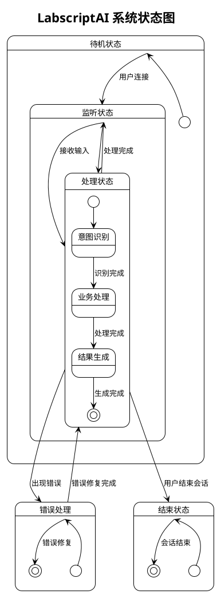
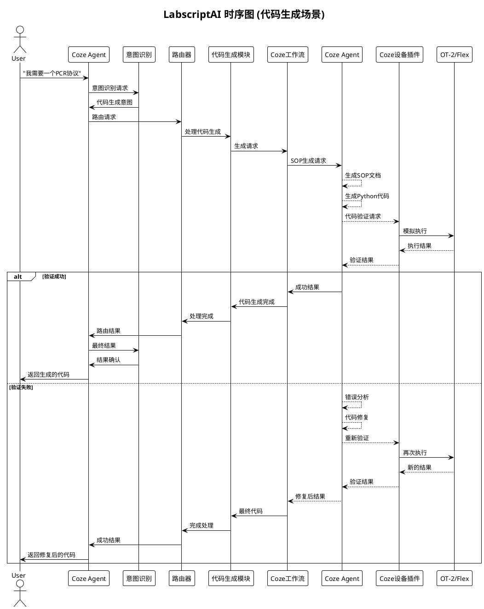

# LabscriptAI Agent 流程 UML 图

## 🎯 整体架构图



## 🔄 详细流程图

```plantuml
@startuml LabscriptAI_Detailed_Flow

!theme plain
skinparam nodesep 30
skinparam ranksep 40

title LabscriptAI Agent 详细处理流程

actor User
participant "Coze Agent" as Coze
participant "意图识别" as Intent
participant "路由分发" as Router
participant "日常对话" as Chat
participant "设备控制" as Device
participant "代码生成" as Code
participant "Coze工作流" as CozeWorkflow
participant "Coze Agent Backend" as CozeAgent
participant "Coze设备插件" as DevicePlugin
database "设备" as Hardware

' 主流程
User -> Coze: 用户输入
activate Coze
Coze -> Intent: 意图识别
activate Intent

alt 日常闲聊
    Intent -> Router: 日常闲聊意图
    Router -> Chat: 处理日常对话
    Chat -> Coze: 返回对话结果
elseif 设备控制
    Intent -> Router: 设备控制意图
    Router -> Device: 设备控制处理
    Device -> CozeWorkflow: 控制请求
    CozeWorkflow -> CozeAgent: 协议处理
    CozeAgent -> DevicePlugin: 设备通信
    DevicePlugin -> Hardware: 执行操作
    Hardware -> DevicePlugin: 执行结果
    DevicePlugin -> CozeAgent: 状态反馈
    CozeAgent -> CozeWorkflow: 处理结果
    CozeWorkflow -> Device: 控制结果
    Device -> Coze: 返回控制结果
elseif 代码生成
    Intent -> Router: 代码生成意图
    Router -> Code: 代码生成处理
    Code -> CozeWorkflow: 生成请求
    CozeWorkflow -> CozeAgent: 协议生成
    activate CozeAgent

    loop 迭代优化
        CozeAgent -> CozeAgent: SOP生成
        CozeAgent -> CozeAgent: 代码生成
        CozeAgent -> DevicePlugin: 代码验证
        DevicePlugin -> CozeAgent: 验证结果
    end

    CozeAgent -> CozeWorkflow: 生成结果
    deactivate CozeAgent
    CozeWorkflow -> Code: 代码结果
    Code -> Coze: 返回代码结果
else 结束聊天
    Intent -> Router: 结束聊天意图
    Router -> Coze: 结束对话
end

deactivate Intent
Coze -> User: 返回处理结果
deactivate Coze

@enduml
```

## 🎯 意图识别流程图



## 🔧 代码生成流程图



## 🤖 设备控制流程图



## 🔄 系统状态图



## 📊 组件交互图

```plantuml
@startuml Component_Interaction

!theme plain
skinparam nodesep 40

title 组件交互关系图

component "用户" as User
component "Coze Agent" as Coze
component "意图识别器" as Intent
component "路由器" as Router
component "日常对话模块" as Chat
component "设备控制模块" as Device
component "代码生成模块" as Code
component "Coze工作流" as CozeWorkflow
component "Coze Agent" as CozeAgentBackend
component "Coze设备插件" as DevicePlugin
component "OT-2" as OT2
component "Flex" as Flex

interface "意图识别接口" as IIntent
interface "处理接口" as IProcess
interface "API接口" as IAPI
interface "设备接口" as IDevice

User -up- IIntent
Coze -up- IIntent
Intent -up- IIntent

Intent -right- IProcess
Router -up- IProcess
Chat -up- IProcess
Device -up- IProcess
Code -up- IProcess

Device -right- IProcess
Code -right- IProcess
CozeWorkflow -up- IProcess

CozeWorkflow -right- CozeAgentBackend
CozeAgentBackend -right- DevicePlugin

DevicePlugin -down- IDevice
OT2 -up- IDevice
Flex -up- IDevice

User --> Coze : 1. 输入
Coze --> Intent : 2. 识别意图
Intent --> Router : 3. 路由请求
Router --> Chat : 4a. 日常对话
Router --> Device : 4b. 设备控制
Router --> Code : 4c. 代码生成

Device --> CozeWorkflow : 5b. 设备请求
Code --> CozeWorkflow : 5c. 生成请求

CozeWorkflow --> CozeAgentBackend : 6. 业务处理
CozeAgentBackend --> DevicePlugin : 7. 设备调用

DevicePlugin --> OT2 : 8a. OT-2控制
DevicePlugin --> Flex : 8b. Flex控制

OT2 --> DevicePlugin : 9a. OT-2结果
Flex --> DevicePlugin : 9b. Flex结果

DevicePlugin --> CozeAgentBackend : 10. 设备结果
CozeAgentBackend --> CozeWorkflow : 11. 处理结果
CozeWorkflow --> Device/Code : 12. 业务结果
Device/Code --> Router : 13. 模块结果
Router --> Intent : 14. 路由结果
Intent --> Coze : 15. 识别结果
Coze --> User : 16. 响应

@enduml
```

## 🎯 时序图



这些UML图完整展示了LabscriptAI Agent的架构设计、处理流程和组件交互关系，为系统设计和实现提供了清晰的视觉指导。