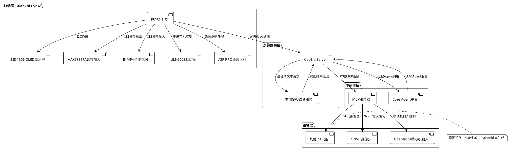
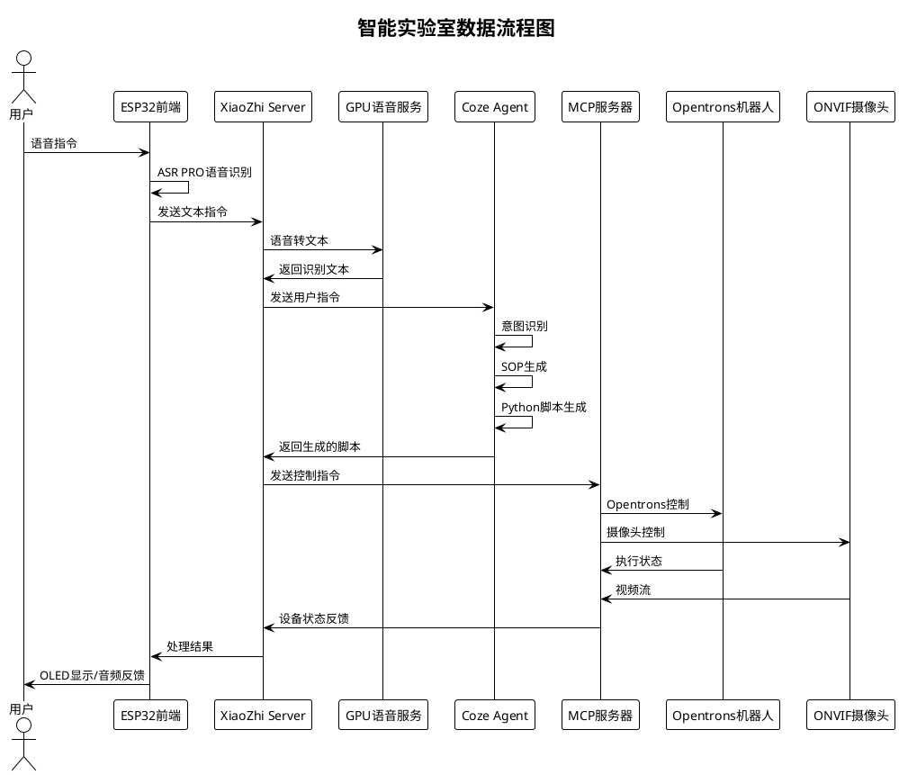
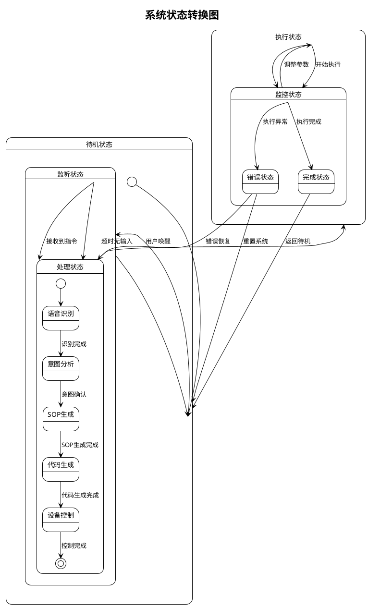
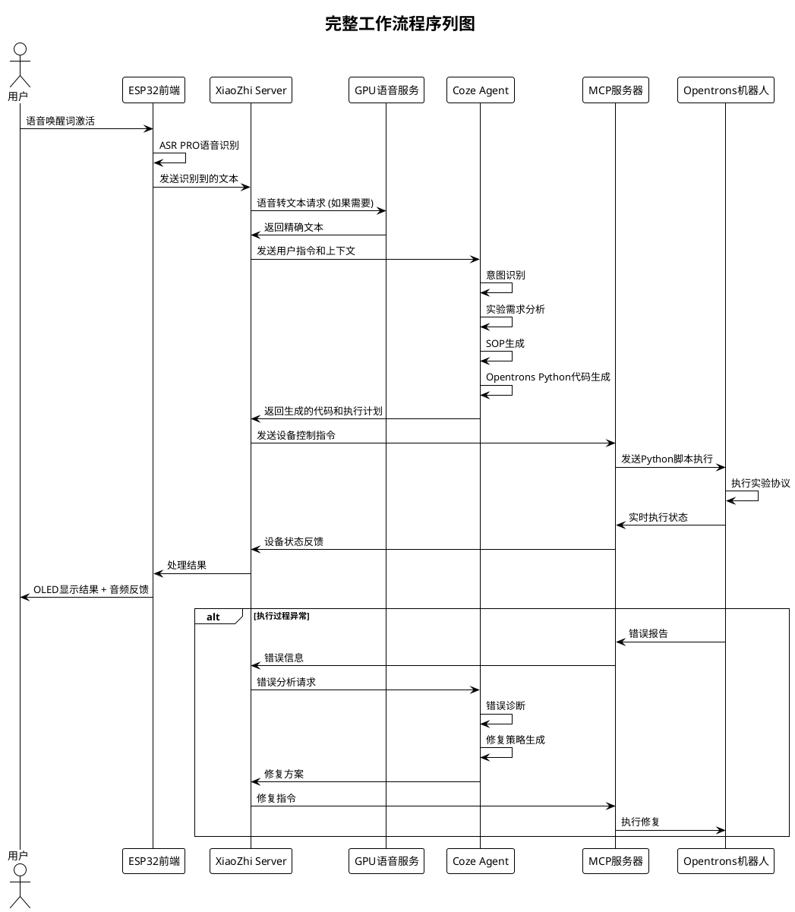

# 智能实验室系统架构 UML 图

## 🏗️ 整体架构图



## 🔄 数据流程图



## 🎯 系统组件图

```plantuml
@startuml Component_Diagram

!theme plain
skinparam nodesep 40

title 系统组件关系图

package "前端硬件组件" {
    component "ESP32开发板" as ESP32 {
        component "WiFi模块" as WiFi
        component "GPIO控制" as GPIO
        component "I2C接口" as I2C
        component "I2S接口" as I2S
    }

    component "显示模块" as Display {
        component "SSD1306 OLED" as OLED
        component "显示驱动" as DisplayDriver
    }

    component "音频模块" as Audio {
        component "INMP441麦克风" as Mic
        component "MAX98357A放大器" as Amp
        component "ASR PRO芯片" as ASR
    }

    component "电机控制" as Motor {
        component "ULN2003驱动板" as ULN2003
        component "步进电机" as Stepper
    }
}

package "后端服务组件" {
    component "XiaoZhi Server" as Server {
        component "Web服务器" as WebServer
        component "WebSocket服务" as WebSocket
        component "RESTful API" as RESTAPI
        component "设备管理器" as DeviceManager
    }

    component "GPU加速服务" as GPU {
        component "语音识别" as STT
        component "图像识别" as ImageRec
        component "CUDA加速" as CUDA
    }
}

package "中间件组件" {
    component "MCP服务器" as MCP {
        component "协议适配器" as ProtocolAdapter
        component "设备代理" as DeviceProxy
        component "消息队列" as MessageQueue
    }

    component "Coze Agent平台" as Coze {
        component "LLM模型" as LLM
        component "意图识别" as Intent
        component "SOP生成器" as SOP
        component "代码生成器" as CodeGen
    }
}

package "外部设备" {
    component "实验室设备" as LabDevices {
        component "Opentrons OT-2" as OT2
        component "Opentrons Flex" as Flex
        component "ONVIF摄像头" as ONVIF
        component "传感器" as Sensors
    }
}

' 硬件连接
ESP32.I2S --> Mic
ESP32.I2S --> Amp
ESP32.I2C --> OLED
ESP32.GPIO --> ULN2003
ESP32.WiFi --> Server.WebServer

' 服务连接
Server.WebSocket --> GPU.STT
Server.RESTAPI --> MCP.ProtocolAdapter
Server.DeviceManager --> Coze.Intent

' 中间件到设备
MCP.DeviceProxy --> OT2
MCP.DeviceProxy --> Flex
MCP.DeviceProxy --> ONVIF
MCP.DeviceProxy --> Sensors

' Coze内部流程
Coze.Intent --> Coze.SOP
Coze.SOP --> Coze.CodeGen
Coze.CodeGen --> Server.DeviceManager

@enduml
```



## 🔧 部署架构图

```plantuml
@startuml Deployment_Architecture

!theme plain
skinparam nodesep 50

title 系统部署架构图

node "前端设备" as Frontend {
    component "ESP32开发板" as ESP32
    component "OLED显示屏" as OLED
    component "音频模块" as AudioModule
    component "麦克风模块" as MicModule
    component "电机驱动板" as DriverBoard
}

node "本地服务器" as LocalServer {
    component "XiaoZhi Server" as XiaoZhiService
    component "GPU服务器" as GPUServer
    component "MCP服务器" as MCPService
}

cloud "云平台" as Cloud {
    component "Coze Agent平台" as CozeAgent
}

node "实验室设备" as LabEquipment {
    component "Opentrons机器人" as OpentronsRobot
    component "ONVIF摄像头" as IPCamera
    component "其他IoT设备" as IoTDevices
}

' 网络连接
Frontend --> LocalServer : WiFi/以太网
LocalServer --> Cloud : HTTPS/API调用
LocalServer --> LabEquipment : LAN/串口

' 内部连接
ESP32 --> OLED : I2C
ESP32 --> AudioModule : I2S
ESP32 --> MicModule : I2S
ESP32 --> DriverBoard : GPIO

XiaoZhiService --> GPUServer : 本地网络调用
XiaoZhiService --> MCPService : 本地进程通信
MCPService --> Opentrons Robot : TCP/IP
MCPService --> IPCamera : RTSP/ONVIF
MCPService --> IoTDevices : MQTT/HTTP

@enduml
```

## 📊 状态图



## 🔄 序列图 - 完整工作流程



这些UML图完整展示了智能实验室系统的架构设计，涵盖了从硬件层到应用层的完整技术栈，以及各组件之间的交互关系和数据流程。