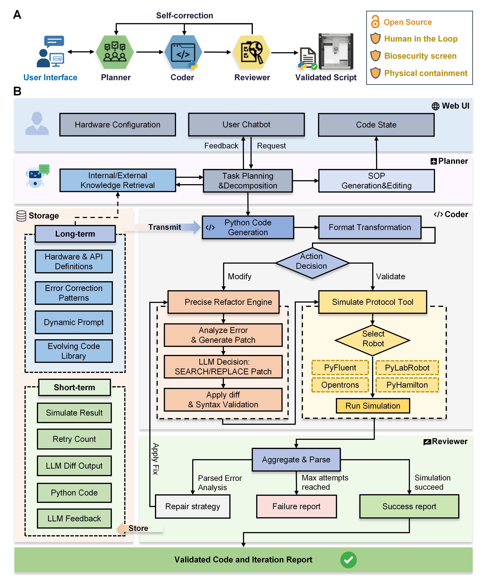
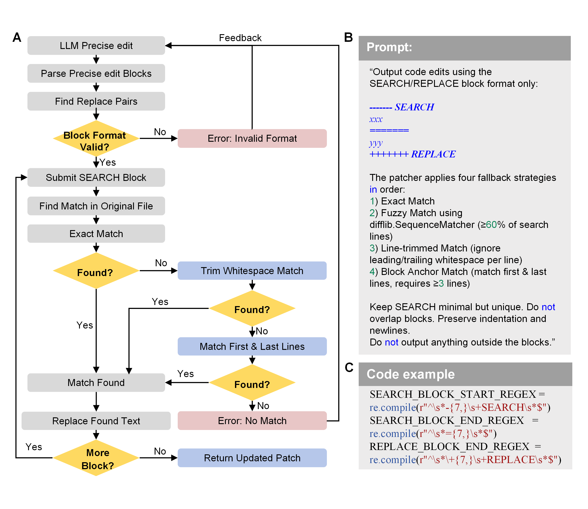
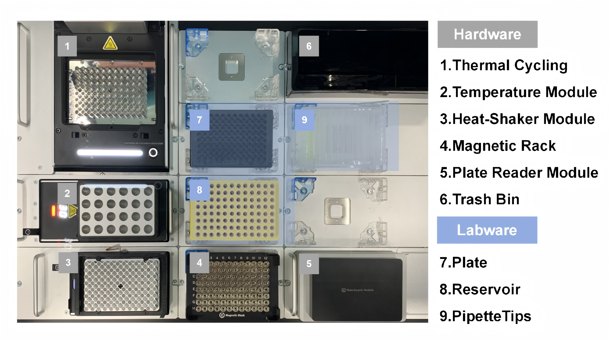

# LabscriptAI: Autonomous Liquid-Handling Robotics Scripting for Accessible and Responsible Protein Engineering
# LabscriptAI：用于可访问且负责任的蛋白质工程的自主液体处理机器人脚本生成框架

**Authors**: Yuan Gao# (高源), Yizhou Luo#, Wenzhuo Li#, Yunquan Lan, Han Jiang, Yongcan Chen, Xiao Yi, Lihao Fu*, Min Yang*, Tong Si*  
*State Key Laboratory for Quantitative Synthetic Biology, Shenzhen Institute of Synthetic Biology, Shenzhen Institutes of Advanced Technology, Chinese Academy of Sciences*  
*定量合成生物学重点实验室，中国科学院深圳先进技术研究院合成生物学研究所*

🌐 **Official Site / 官网**: [https://LabScriptAI.cn](https://LabScriptAI.cn)

---

## 📖 Abstract / 摘要

**[English]**  
Laboratory automation enhances experimental throughput and reproducibility, yet widespread adoption is constrained by the expertise required for robotic programming. Here, we developed **LabscriptAI**, a multi-agent framework enabling large language models (LLMs) to autonomously generate and validate executable Python scripts for protein engineering automation. LabscriptAI automated cell-free protein synthesis (CFPS) and characterization of 298 green fluorescent protein (GFP) variants designed by 53 teams from 5 countries in a student challenge. The top variant matched the performance of extensively optimized superfolder GFP (sfGFP) while exploring a distinct sequence space. Furthermore, LabscriptAI orchestrated distributed automation across biofoundry and fume hood-enclosed systems to engineer enzyme variants utilizing formaldehyde—a sustainable but hazardous substrate—identifying a double mutant with 7-fold enhanced catalytic efficiency. The platform implements rigorous safety measures, including biosecurity screening, physical containment, and human-in-the-loop oversight, to safeguard autonomous protein engineering. LabscriptAI democratizes laboratory automation by eliminating programming barriers while promoting responsible research practices.

**[中文]**  
实验室自动化能够显著提高实验通量和可重复性，但机器人编程所需的专业知识限制了其广泛应用。为此，我们开发了 **LabscriptAI**，这是一个多智能体（Multi-agent）框架，能够赋能大语言模型（LLMs）自主生成并验证用于蛋白质工程自动化的可执行 Python 脚本。LabscriptAI 成功自动化了无细胞蛋白合成（CFPS）流程，并对来自 5 个国家 53 支学生队伍设计的 298 个绿色荧光蛋白（GFP）变体进行了表征。结果显示，表现最佳的变体在探索不同序列空间的同时，达到了经过广泛优化的超折叠 GFP（sfGFP）的性能水平。此外，LabscriptAI 还协调了跨越生物铸造厂和通风橱封闭系统的分布式自动化流程，用于工程化利用甲醛（一种可持续但有害的底物）的酶变体，最终鉴定出一个催化效率提高 7 倍的双突变体。该平台实施了严格的安全措施，包括生物安全筛查、物理遏制和“人在回路（Human-in-the-loop）”监管，以保障自主蛋白质工程的安全性。LabscriptAI 通过消除编程障碍普及了实验室自动化，同时促进了负责任的研究实践。

---

## 🏗️ System Architecture / 系统架构

**[English]**  
LabscriptAI employs a **Multi-Agent Architecture** orchestrated by LangGraph, separating high-level planning from low-level code implementation.

1.  **Task Planning Agent**: Coordinates workflow processing. It translates natural language requests into structured Standard Operating Procedures (SOPs) and initiates human-in-the-loop dialogue for validation.
2.  **Code Graph Backend**: An iterative code generation engine featuring:
    *   **Coder Agent**: Generates initial Python scripts utilizing domain knowledge (RAG) and hardware profiles.
    *   **Reviewer Agent**: Validates code using platform-specific simulators (Opentrons Simulator, PyLabRobot, pyFluent).
    *   **Precise Refactoring Engine (PRE)**: Instead of regenerating entire scripts upon error, PRE analyzes simulation logs to generate targeted `SEARCH/REPLACE` patches, ensuring convergence and stability.

**[中文]**  
LabscriptAI 采用由 LangGraph 编排的**多智能体架构**，实现了高层任务规划与底层代码实现的解耦。

1.  **任务规划智能体 (Task Planning Agent)**：负责协调工作流处理。它将用户的自然语言需求转化为结构化的标准操作程序（SOP），并启动“人在回路”对话进行确认。
2.  **代码图后端 (Code Graph Backend)**：一个迭代式的代码生成引擎，包含：
    *   **编码智能体 (Coder Agent)**：利用领域知识（RAG）和硬件配置文件生成初始 Python 脚本。
    *   **审查智能体 (Reviewer Agent)**：调用平台特定的模拟器（Opentrons Simulator, PyLabRobot, pyFluent）验证代码。
    *   **精准重构引擎 (Precise Refactoring Engine, PRE)**：当验证出错时，PRE 不会重新生成整个脚本，而是分析模拟日志，生成针对性的 `SEARCH/REPLACE` 补丁，从而保证代码收敛和稳定性。



### 🎯 Precise Refactoring Engine / 精准重构引擎

**[English]**  
Traditional LLM-based code generation often struggles with "fixing one bug but introducing another" when regenerating full files. LabscriptAI's **Precise Refactoring Engine (PRE)** adopts a patching strategy. It locates the specific error block based on simulator feedback and applies a minimal edit, significantly reducing token usage and improving success rates.

**[中文]**  
传统的基于 LLM 的代码生成在重新生成整个文件时，经常会遇到“修复一个 bug 但引入另一个 bug”的问题。LabscriptAI 的 **精准重构引擎 (PRE)** 采用补丁策略。它根据模拟器的反馈定位具体的错误代码块，并应用最小化的编辑，显著减少了 Token 消耗并提高了成功率。



---

## ✨ Key Features / 核心特性

### 1. Cross-Platform Support / 跨平台支持

**[English]**  
LabscriptAI is hardware-agnostic, supporting major liquid-handling platforms through unified interfaces and adapter layers:
*   **Opentrons (OT-2 & Flex)**: Native support via Opentrons Python API v2.
*   **Tecan (Fluent & EVO)**: Supported via our custom-developed **[pyFluent](pyFluent/README.md)** library, compiling Python to `.gwl` worklists.
*   **Hamilton (Vantage & STAR)**: Integrated via the open-source **PyLabRobot** driver.

**[中文]**  
LabscriptAI 具有硬件无关性，通过统一接口和适配层支持主流液体处理平台：
*   **Opentrons (OT-2 & Flex)**：通过 Opentrons Python API v2 提供原生支持。
*   **Tecan (Fluent & EVO)**：通过我们需要自研的 **[pyFluent](pyFluent/README.md)** 库支持，将 Python 代码编译为 `.gwl` 工作列表。
*   **Hamilton (Vantage & STAR)**：集成开源驱动 **PyLabRobot** 进行支持。


*Figure 2: Cross-platform validation of the iGEM plate reader calibration protocol on Opentrons, Tecan Fluent, and Hamilton Vantage.*

### 2. Complex Workflow Automation / 复杂工作流自动化

**[English]**  
In the **CAPE (Critical Assessment of Protein Engineering)** competition, LabscriptAI automated the screening of 298 student-designed GFP variants. It handled complex deck layouts, multi-step dilutions, and plate reader integration.

**[中文]**  
在 **CAPE (蛋白质工程关键评估)** 竞赛中，LabscriptAI 自动化了 298 个学生设计的 GFP 变体的筛选工作。它成功处理了复杂的甲板布局、多步稀释以及酶标仪集成。



### 3. Responsible AI & Safety / 负责任的 AI 与安全

**[English]**  
*   **Biosecurity Screening**: Integration with the **IBBIS Common Mechanism** to screen DNA sequences for potential threats before synthesis.
*   **Physical Containment**: Distributed automation strategies for handling hazardous reagents (e.g., Formaldehyde) in fume hood-enclosed robots.
*   **Human-in-the-loop**: Mandatory human validation for critical SOPs and safety-sensitive operations.

**[中文]**  
*   **生物安全筛查**：集成 **IBBIS 通用机制**，在合成前对 DNA 序列进行潜在威胁筛查。
*   **物理遏制**：针对危险试剂（如甲醛），采用在通风橱封闭机器人中进行的分布式自动化策略。
*   **人在回路**：关键 SOP 和安全敏感操作强制要求人类验证。

---

## 🚀 Quick Start / 快速开始

For detailed installation instructions, please refer to [📄 Installation Guide (docs/INSTALLATION.md)](docs/INSTALLATION.md).
详细安装指南请参阅 [📄 安装文档 (docs/INSTALLATION.md)](docs/INSTALLATION.md)。

### Environment Setup / 环境配置

**[English]**  
We use a **dual-virtual-environment architecture** to isolate Opentrons dependencies (which often conflict with modern AI libraries).
**[中文]**  
我们采用**双虚拟环境架构**来隔离 Opentrons 依赖（其经常与现代 AI 库发生冲突）。

```powershell
# Windows PowerShell (One-click setup / 一键安装)
.\scripts\setup-uv.ps1
```

### Running the Application / 运行应用

1.  **Start Backend / 启动后端**:
    ```powershell
    .\.venv\Scripts\Activate.ps1
    uv run python main.py
    ```

2.  **Start Frontend / 启动前端**:
    ```bash
    cd labscriptAI-frontend
    npm run dev
    ```

3.  **Access / 访问**:
    Open your browser at **http://localhost:5173**

---

## 📂 Documentation / 文档资源

*   [🛠️ Installation & Troubleshooting / 安装与故障排除](docs/INSTALLATION.md)
*   [📚 API Architecture / API 架构说明](docs/API_ARCHITECTURE.md)
*   [🧪 pyFluent Library / pyFluent 库文档](pyFluent/README.md)

---

## 🔗 References & Citation / 引用

If you use LabscriptAI in your research, please cite our work, thanks! 😊:
如果您在研究中使用了 LabscriptAI，请引用我们的工作，感谢大佬！🙏：

> Yuan G, et al. "Autonomous liquid-handling robotics scripting through large language models enables accessible and safe protein engineering workflows." bioRxiv (2025): 2025-09.

**Key Technologies used / 关键技术:**
*   **LangGraph**: [Build resilient language agents as graphs](https://langchain-ai.github.io/langgraph/).
*   **CodeAct**: [Executable Code Actions](https://arxiv.org/abs/2402.01030).
*   **PyLabRobot**: [Hardware-agnostic interface for liquid-handling robots](https://docs.pylabrobot.org/).
*   **IBBIS**: [Common Mechanism for DNA Synthesis Screening](https://www.ibbis.org/).

---

## 📧 Contact / 联系方式
📮 Facing code problem please contact: gaoyuanbio@qq.com

*State Key Laboratory for Quantitative Synthetic Biology, Shenzhen Institute of Synthetic Biology,CAS.*
*中国科学院深圳先进技术研究院合成生物学研究所，定量合成生物学重点实验室*
