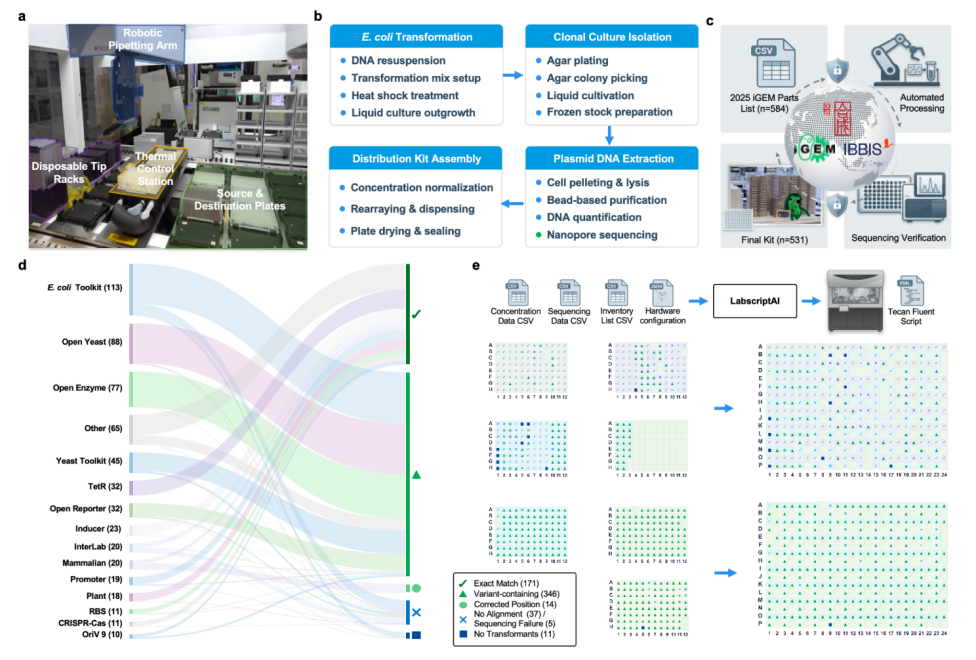

# LabscriptAI

**Natural-language liquid handling with closed-loop simulation, deck visualization, and gated live recovery.**

[](https://github.com/KRATSZ/LabScript-AI/releases/tag/v1.0-canonical)
[](https://doi.org/10.5281/zenodo.17697326)

Writing automation scripts for liquid-handling robots is often tedious. Asking a general-purpose LLM for help usually leads to a frustrating cycle: you get a snippet of Python, paste it into your robot software, hit a `LabwareNotFoundError` or volume error, paste the traceback back into chat, and repeat. And when something fails on the physical deck—like an empty tip box or a dry source well—standard scripts just crash.

**LabscriptAI** connects protocol authoring, simulation, and hardware execution into a reliable workflow:
1. **Closed-loop protocol authoring:** You describe your experiment in plain language. The agent writes the protocol, runs it against platform simulators and logic checkers, and automatically patches errors until the script passes.
2. **Interactive web agent with "Watch" playback:** Through a browser interface, you can author protocols across five robot platforms. For Opentrons OT-2 and Flex, once checks pass, the **Watch** deck viewer lets you step through commands and inspect the animated deck layout before touching real hardware.
3. **Gated live recovery on Opentrons:** When running on a live Opentrons Flex, the agent monitors the command queue. If an operation fails mid-run (such as a missing tip or depleted well), it diagnoses the issue and proposes a recovery action.
4. **Deterministic safety gate (`allow` / `ask` / `suspend`):** The language model never has raw control over robot motion. A deterministic gatekeeper evaluates every candidate action against safety rules—auto-allowing safe retries, asking an operator when human judgment is needed, and immediately halting on hardware faults or contamination risks.

---

> **Try the web demo (no hardware needed):** [labscriptai.cn](https://labscriptai.cn/)  
> Or run it locally at [http://127.0.0.1:5173](http://127.0.0.1:5173).

<!-- Demo video placeholder: video walkthroughs and screencasts will be linked here -->

---

## System Overview

LabscriptAI separates protocol creation at your desk from live execution on the robot deck:


- **The Authoring Loop (Desk):** Converts your natural-language intent and SOP into a verified protocol package (`protocol.py`, step manifests, and execution traces). A platform simulator catches labware mismatches, volume overflows, and trajectory issues before anything touches hardware.
- **The Runtime Loop (Robot):** Runs only validated packages. While the robot executes commands, the agent tracks live status. If a command fails, the agent looks up recovery playbooks and proposes a fix.
- **Human-in-the-Loop & Safety Gates:** Operators confirm initial SOP plans and review edge-case recoveries. Critical safety rules—like collision prevention and tip budget limits—are hardcoded and deterministic.
- *A note on biosecurity:* While the architecture supports biosecurity screening and containment checkpoints (as illustrated above), sequence-level biosecurity screening in practical deployment is the operator's responsibility; it is not automated by this code repository.

---

## Closed-Loop Authoring vs. Manual Chat Debugging

Most LLM coding tools leave you acting as the manual error-fetcher:


Instead of handing you raw code to debug yourself:
- **Plan & Generate:** The agent structures the SOP into formal steps (volumes, labware slots, pipetting mechanics).
- **Simulate & Verify:** The script is immediately run against Opentrons simulation and the `LogicPass` validation engine.
- **Targeted Self-Correction:** When simulation fails (e.g., missing labware definition or invalid tip rack slot), the agent applies focused search/replace patches directly to the protocol file and re-simulates.
- **Ready-to-Run Packages:** You receive complete, downloadable protocol packages with verified step tables and manifests rather than a one-off code snippet.

---

## Safety Architecture: The Allow / Ask / Suspend Gate

LLMs are creative, but physical lab hardware cannot tolerate hallucinated movements or rogue jogs. In LabscriptAI, the language model can only submit **candidate actions**. Every action must pass through an independent, deterministic gatekeeper:


| Gate Decision | What It Means | Examples |
|---|---|---|
| **`allow`** | Safe and pre-authorized. May execute immediately without operator interruption. | Retrying tip pickup from the next valid well in the rack; switching to a pre-mapped spare buffer well. |
| **`ask`** | Needs human confirmation. The system pauses and prompts the operator to approve or provide details. | Selecting an unconfirmed substitute reagent; ambiguous sensor readings. *(In non-interactive daemon mode, `ask` automatically upgrades to `suspend`.)* |
| **`suspend`** | Immediate halt. Execution stops safely to protect hardware and samples. | Physical deck collision; hardware actuator faults; tip budget exhausted; risk of a contaminated tip entering common stock; unknown errors. |

---

## Real-Time Monitoring and Recovery

On a live Opentrons Flex, runs proceed through an active command queue:


### Tiered Sensor Stack
To avoid hallucinations or sensor misreads causing hardware errors, inputs are organized into distinct trust tiers:
1. **Tier 1 & 2 (Authoritative):** Robot controller HTTP status and MCP state. What the controller reports is the ground truth of the deck.
2. **Tier 3 (Advisory Evidence):** On-deck camera captures (with YOLO/VLM component detection overlays) and pipette pressure traces. These provide helpful diagnostic context for the agent, but they can never override controller telemetry or force a resume.

### Playbooks and Case Memory
When a command fails (such as an empty reservoir or unseated tip):
- The agent classifies the error against a standardized taxonomy (`labscriptai/plugins/skills/error-taxonomy.md`).
- It selects a recovery playbook (`labscriptai/plugins/skills/recovery-playbooks.md`) to craft a safe candidate response.
- If a similar issue was resolved previously—for example, switching from an empty fluorescein well at A3 to a reserve well at A4—the system recalls that case memory to streamline the recovery while still verifying through the gatekeeper.

---

## Supported Robots: Live Execution vs. Authoring-Only

Different robots have different interfaces and access levels. Here is exactly what this repository supports:

| Robot Platform | Authoring & Verification | Deck Replay ("Watch") | Live Control & Recovery |
|---|---|---|---|
| **Opentrons Flex** | Full Python protocol generation + Opentrons simulator | Yes (web demo Stage view) | Yes — documented live path via HTTP API (`:31950`) with automated recovery playbooks |
| **Opentrons OT-2** | Full Python protocol generation + Opentrons simulator | Yes (web demo Stage view) | Yes — connects via port `:31950`; recovery playbooks were primarily developed for Flex |
| **Hamilton STAR** | Step JSON + runnable PyLabRobot (`.py`) scripts | No | Authoring-only (no live hardware driver in this repo) |
| **Hamilton Vantage** | Step JSON + runnable PyLabRobot (`.py`) scripts | No | Authoring-only (no live hardware driver in this repo) |
| **Tecan Fluent** | Step JSON + `.gwl` worklists | No | Authoring-only (no live hardware driver in this repo) |

### The "Watch" Deck Visualizer
In the web demo, **Watch** is the built-in Opentrons deck visualizer. When an OT-2 or Flex protocol passes simulation, the Watch button appears on the Stage tab. It renders the deck layout, labware placements, and lets you scrub through each pipetting step. (Because Hamilton and Tecan use distinct proprietary runtimes, their protocols output clean step tables and script downloads without web deck playback).

---

## Real-World Applications

LabscriptAI has been tested on real-world synthetic biology workflows, including high-throughput plate mapping and assembly for the iGEM parts distribution kit:



Workflows demonstrated include:
- *E. coli* transformation and outgrowth setup
- Clonal culture isolation and liquid cultivation
- Bead-based plasmid DNA extraction
- High-throughput distribution kit assembly: taking sequencing, concentration, and inventory manifests to calculate volume normalizations and map liquid transfers across 96-well and 384-well plates.

---

## Getting Started

### Prerequisites
- **Python 3.10+**
- **Node.js 18+** (required for the Opentrons robot backend and web demo)
- An API key for DeepSeek (`DEEPSEEK_API_KEY`) or an OpenAI-compatible provider.

---

### Option 1: Browser Web Demo (Recommended for protocol authoring)

You can try the hosted version directly at [labscriptai.cn](https://labscriptai.cn/).

To run the web interface locally on your machine (binds strictly to `127.0.0.1`):

```bash
cd labscriptai/webdemo
cp .env.example .env          # Add your LABSCRIPTAI_DEEPSEEK_API_KEY
pip install -r python/requirements-code-service.txt
npm install
npm run dev
```

Open [http://127.0.0.1:5173](http://127.0.0.1:5173) in your browser.

This command starts:
- The frontend UI on port `5173`
- The web agent server on port `8787`
- The local Opentrons code analyze service on port `8010` (used for Python simulation and generating Watch deck playback)

For more details on web demo configuration, see [`labscriptai/webdemo/README.md`](labscriptai/webdemo/README.md).

---

### Option 2: CLI Agent (Desk authoring & live Opentrons control)

Install the package in an isolated virtual environment:

```bash
git clone https://github.com/KRATSZ/LabScript-AI.git
cd LabScript-AI/labscriptai

python3 -m venv .venv && source .venv/bin/activate
pip install -e .
pip install "opentrons>=7,<9"   # Required for local Opentrons simulation
pip install -e ".[dev]"         # Optional: for running pytest

# Install the Node-based Opentrons robot backend
cd plugins/mcp/opentrons-mcp && npm install && cd -
```

Configure environment variables (in a `.env` file or exported in your shell):
```bash
DEEPSEEK_API_KEY=your_api_key_here
ROBOT_IP=192.168.x.x           # Optional until connecting to physical hardware
```

#### Run Health Check
Verify your environment, dependencies, and optional robot connectivity:
```bash
labscriptai doctor                 # Check toolchain, Node, Python, and API key
labscriptai doctor --robot <IP>    # Also ping the robot's :31950/health endpoint
```

#### Start Interactive Chat
```bash
labscriptai chat                   # Interactive agent (default: DeepSeek)
labscriptai chat --provider offline # Smoke test the REPL without making API calls
```

#### Live Recovery and Daemon Modes (Opentrons)
If a run on your robot has failed or paused:
```bash
# Run a single recovery turn to diagnose and propose a fix
labscriptai recover --robot <IP> --run-id <RUN_ID>

# Or run the background daemon to watch the command queue and handle issues automatically
labscriptai daemon --robot <IP> --run-id <RUN_ID>
```

#### Testing Without Hardware (`fake_robot`)
You don't need a physical Opentrons robot to test recovery workflows. You can run the built-in mock server:

```bash
# In terminal 1: start the mock robot server simulating a tip pickup failure
python -m labscriptai.fake_robot --host 127.0.0.1 --port 31950 --scenario tip_missing_budget_block

# In terminal 2: probe the mock robot
labscriptai doctor --robot 127.0.0.1
```

See [`labscriptai/fake_robot/README.md`](labscriptai/fake_robot/README.md) for available mock scenarios (liquid depletion, door open, e-stop, etc.).

To run the package test suite:
```bash
cd labscriptai && pytest -q
```

---

## Repository Structure

```
labscriptai/
  agent/                     # CLI agent implementation (chat, doctor, recover, daemon) and safety gate
  benchmark/logicpass/       # LogicPass / FinalPass_v2 protocol verification engine
  planir/                    # Step plan intermediate representation (Hamilton / Tecan)
  fake_robot/                # Mock Opentrons HTTP server for offline testing
  plugins/skills/            # Recovery playbooks, error taxonomies, and safety briefs
  plugins/mcp/opentrons-mcp/ # Node backend for Opentrons HTTP / WebSocket communication
  webdemo/                   # Interactive browser UI, agent server, and analyze service
  tests/                     # Test suite
assets/                      # Architectural and workflow figures
```

---

## Safety Guidelines for Live Hardware

Before running live protocols on physical equipment, please review the safety specifications:
- [`labscriptai/plugins/skills/safety-brief.md`](labscriptai/plugins/skills/safety-brief.md) — Operational guidelines and boundaries
- [`labscriptai/plugins/skills/error-taxonomy.md`](labscriptai/plugins/skills/error-taxonomy.md) — How errors are detected and classified
- [`labscriptai/plugins/skills/recovery-playbooks.md`](labscriptai/plugins/skills/recovery-playbooks.md) — Pre-approved recovery strategies

*Important:* Never run multiple automated clients or manual scripts against the same robot at the same time.

---

## Citation & References

- **Code Repository:** [github.com/KRATSZ/LabScript-AI](https://github.com/KRATSZ/LabScript-AI)
- **Dataset & Shards:** [Zenodo DOI: 10.5281/zenodo.17697326](https://doi.org/10.5281/zenodo.17697326)

## License

MIT
